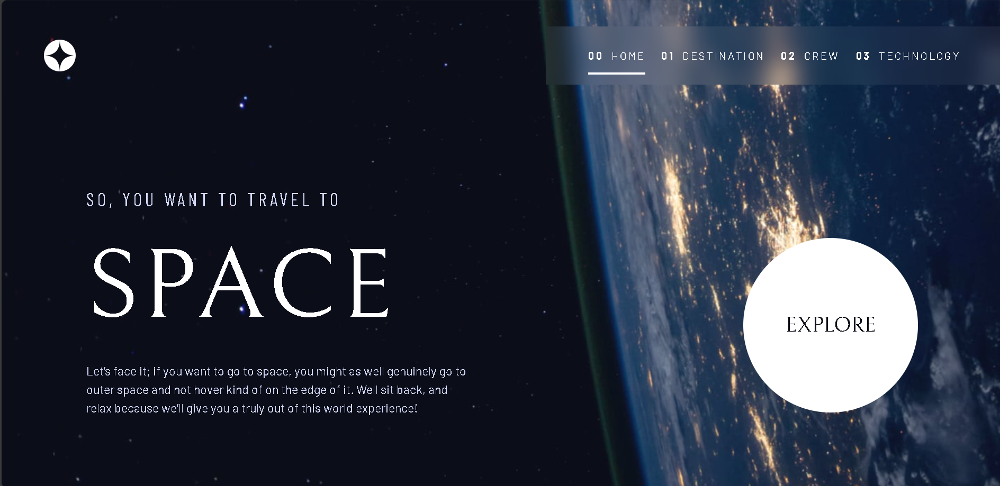
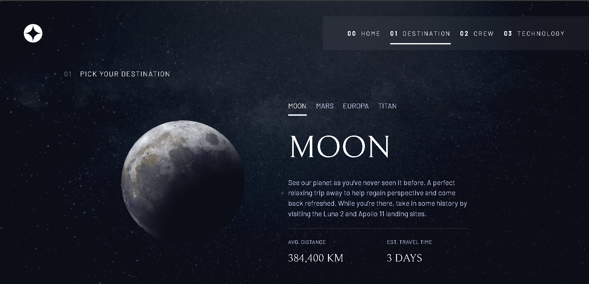
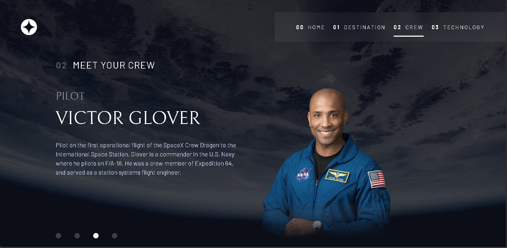
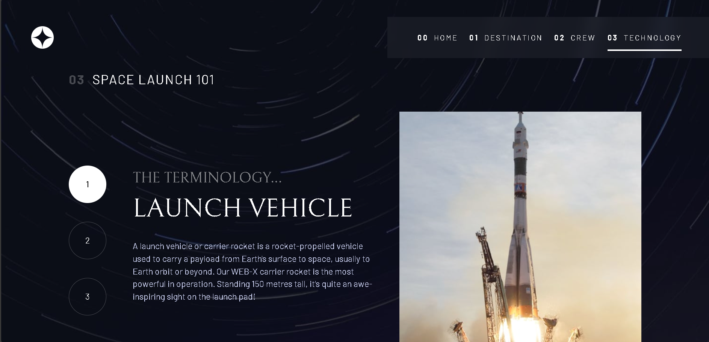

# Frontend Mentor - Space tourism website solution

This is a solution to the [Space tourism website challenge on Frontend Mentor](https://www.frontendmentor.io/challenges/space-tourism-multipage-website-gRWj1URZ3). Frontend Mentor challenges help you improve your coding skills by building realistic projects.

## Table of contents

- [Overview](#overview)
  - [The challenge](#the-challenge)
  - [Screenshot](#screenshot)
  - [Links](#links)
- [My process](#my-process)
  - [Built with](#built-with)
  - [What I learned](#what-i-learned)
  - [Continued development](#continued-development)
  - [Useful resources](#useful-resources)
- [Author](#author)
- [Acknowledgments](#acknowledgments)

**Note: Delete this note and update the table of contents based on what sections you keep.**

## Overview

### The challenge

Users should be able to:

- View the optimal layout for each of the website's pages depending on their device's screen size
- See hover states for all interactive elements on the page
- View each page and be able to toggle between the tabs to see new information

### Screenshot

### Links

- Solution URL: [https://github.com/engmohamedtarek1/space-tourism](https://github.com/engmohamedtarek1/space-tourism)
- Live Site URL: [https://spacetourism-website.vercel.app/](https://spacetourism-website.vercel.app/)

## My Process

### Built with

- **Semantic HTML5 markup** - Ensuring clear structure and accessibility of the content.
- **CSS custom properties** - For creating reusable and maintainable styles.
- **Flexbox** - Used for flexible layouts and aligning elements in a row or column.
- **CSS Grid** - For creating complex grid-based layouts, especially for the page layout.
- **Mobile-first workflow** - Designing and building from mobile view upwards for better responsiveness.
- **[React](https://reactjs.org/)** - A powerful JavaScript library for building user interfaces, handling components, and state.
- **[React Router](https://reactrouter.com/)** - For client-side routing, allowing seamless navigation between pages.
- **[TailwindCSS](https://tailwindcss.com/)** - For utility-first CSS and rapid UI development.
- **[Framer Motion](https://www.framer.com/motion/)** - For smooth animations and page transitions.

---

### Key Features Implemented

1. **Responsive Navigation**:

   - Created a responsive navigation bar with a mobile menu (hamburger) that slides in.
   - Implemented smooth transitions for menu open/close using Framer Motion.

2. **Crew & Destination Pages**:

   - Displayed crew and destination data dynamically using React states and arrays.
   - Added clickable buttons (bullets) to switch between crew members and destinations.

3. **Smooth Image Fade**:

   - Applied a smooth gradient fade-out effect on images (e.g., crew images) for better visual experience.

4. **Page Transitions**:

   - Used Framer Motion to animate transitions between different pages/routes, providing a polished and fluid user experience.

5. **Device-Specific Backgrounds**:
   - Configured different background images for mobile, tablet, and desktop views using TailwindCSS’s responsive utility classes.

---

### Steps in Building the Website

1. **Setup the Project Environment**:

   - Initialize a new React app.
   - Install dependencies: `react-router-dom`, `styled-components`, `tailwindcss`, `framer-motion`.

2. **Routing Setup**:

   - Configured routing with React Router to handle navigation between pages (Home, Destination, Crew, Technology).

3. **Component Structure**:

   - Designed reusable components for `Header`, `Footer`, and the layout structure.
   - Created separate components for each section (Home, Destination, Crew, etc.).

4. **Mobile-First Development**:

   - Began development with the mobile view, progressively enhancing the design for tablet and desktop sizes.

5. **Styled Components & TailwindCSS**:

   - Applied scoped component styling using `styled-components`.
   - Used TailwindCSS utilities for faster layout adjustments and responsive design.

6. **Data Rendering**:

   - Fetched the crew and destination data from a static file and mapped the data to render dynamically on the page.
   - Enabled crew member and destination switching using state management with React's `useState`.

7. **Animations & Transitions**:

   - Integrated Framer Motion to add smooth page transitions and animations for elements like menu, content fade-ins, etc.

8. **Testing & Optimization**:
   - Ensured that all pages were fully responsive across different device sizes.
   - Optimized performance and tested for potential UI bugs.

Here's a section on what you learned during the process of building the Space Tourism website:

---

## What I Learned

1. **Handling Responsive Design**:

   - Mastered the **mobile-first workflow**, ensuring the website adapts seamlessly from smaller screens to larger displays.
   - Learned how to apply **device-specific backgrounds** using utility classes in TailwindCSS to optimize visuals for mobile, tablet, and desktop devices.

2. **Managing State in React**:

   - Gained experience in using **React hooks** like `useState` to manage dynamic data, such as switching between different crew members or destinations with simple and effective state management.

3. **Component-Based Design**:

   - Improved understanding of **modular design** by breaking down the website into reusable components, which enhanced both development efficiency and maintainability.

4. **Animations with Framer Motion**:

   - Learned how to implement smooth **animations and transitions** between pages using **Framer Motion**, making the user experience more polished and interactive.

5. **Using CSS Gradients for Image Effects**:

   - Learned how to create a **smooth fade-out effect on images** with CSS gradients, improving the visual presentation of crew and destination images.

6. **Customizing TailwindCSS**:

   - Gained better knowledge of **TailwindCSS** by utilizing custom configurations and responsive utilities to create a clean and consistent UI.

7. **Client-Side Routing with React Router**:

   - Improved skills in setting up **client-side routing** with **React Router**, allowing seamless navigation between different pages without reloading the browser.

8. **Optimizing User Interface (UI)**:

   - Developed the ability to optimize the UI for **accessibility** and **usability**, ensuring that the navigation, buttons, and content are easy to interact with across all devices.

9. **Problem Solving**:
   - Enhanced problem-solving skills by working through challenges like implementing the sticky navigation, smooth image effects, and dynamic content loading.

## Author

- Website - [Mohamed Tarek](https://engmohamedtarek.vercel.app/)
- Frontend Mentor - [@engmohamedtarek1](https://www.frontendmentor.io/profile/engmohamedtarek1)
- Twitter - [@engmohamedtar](https://www.twitter.com/engmohamedtar)

## Acknowledgments

❤️ Big Thanks to [Mohamed Beltagy]() for helping me a lot in using animations how to optimize the memory.